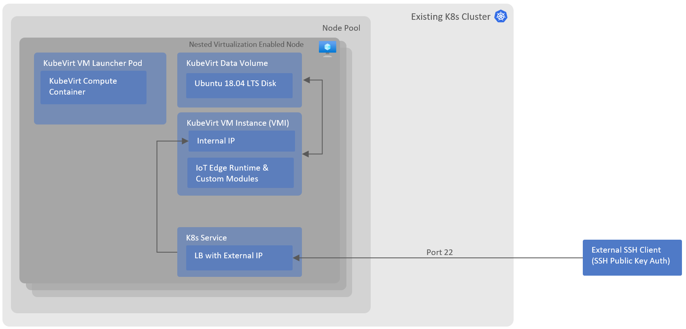

# IoT Edge on Kubernetes with KubeVirt

This repo provides a guidance and an accelerator to deploy Azure IoT Edge runtime in a VM, on Kubernetes(K8s) cluster.

There are two primary reasons why we may want to run IoT Edge on K8s cluster, they are horizontal scale and resilience. Horizontal scale allow running compute on multiple physical or virtualized machines and thus allow a degree of parallelism on the edge, resilience on the other hand allow services to recover from the underlying hardware failure without a manual intervention. This solution covers the resilience aspect of IoT Edge runtime and its modules, it does not specifically address horizontal scale aspect of it which may need changes in the runtime design. Please note this repo provides a solution for running IoT Edge version 1.2 onwards on K8s, if you are running IoT Edge v1.1 LTS, you can follow the instructions [here](https://docs.microsoft.com/en-us/azure/iot-edge/how-to-install-iot-edge-kubernetes?view=iotedge-2018-06) but be aware that v1.1 will only be [supported until Dec 2022](https://azure.microsoft.com/nb-no/updates/iot-edge1-1-0/).

## Solution

IoT Edge runtime is designed to run on a machine (virtual or bare metal) with a supported Linux OS on it, therefore the easiest way to run it on K8s will be to host it inside a Linux VM on K8s. [KubeVirt](http://kubevirt.io/) a CNCF adopted project enables hosting of VMs in K8s cluster along side containers, creating a high density container and VM hosting platform. KubeVirt is a virtualization extension for K8s which makes use of Custom Resource Definition to add VM and other related resource types to the K8s cluster.

This solution implements a "lift and shift" approach and it does not need any changes in IoT Edge runtime or configuration to run inside the VM on K8s, making it a simple and compatible option out of the box. In this example, we are making use of Azure's K8s service called Azure Kubernetes Service (AKS) for the ease of demonstration but the solution is applicable to other K8s managed or unmanaged deployments as well.

Following architecture explains the way various components are connected together to enable IoT Edge runtime hosted in a VM.



## Deploying AKS (Azure K8s) Cluster

### Prerequisites

1. Nested Virtualization Enabled Node Pool: This a required to allow VM level virtualization on K8s nodes, Virtual/Physical machines with CPUs featuring Intel VT-x and EPT technology or AMD EPYC/Ryzen support nested virtualization. If you are using AKS for K8s as in this example, please refer to the VM list [list](https://docs.microsoft.com/en-us/azure/virtual-machines/acu). Alternatively, you should be able to emulate virtualisation for dev/test environments, this is not recommended for production/high performance/isolated requirements.
2. [KubeVirt](https://kubevirt.io/user-guide/operations/installation/)
3. [CDI (Containerized Data Importer)](https://github.com/kubevirt/containerized-data-importer) add-on must be installed on the K8s cluster. CDI is required to mount the data volume which includes VM disk (e.g. Ubuntu 18.04 LTS disk)

### Create AKS Cluster with Prerequisites

Use the following Azure CLI commands to create AKS cluster with all the prerequisites required to run KubeVirt.

1. Create a Resource Group

    `az group create --location northeurope --resource-group IoTEdgeK8s`

2. Create AKS cluster in Azure

    `az aks create --resource-group IoTEdgeK8s --network-policy calico --network-plugin kubenet --node-vm-size Standard_D4s_v3 --node-count 1 --nodepool-name primary --name IoTEdgeVMs`

3. Retrieve AKS credentials

    `az aks get-credentials -g IoTEdgeK8s -n IoTEdgeVMs`

4. Deploy KubeVirt (v0.53.1)

    `export RELEASE=v0.53.1 && kubectl apply -f https://github.com/kubevirt/kubevirt/releases/download/${RELEASE}/kubevirt-operator.yaml && kubectl apply -f https://github.com/kubevirt/kubevirt/releases/download/${RELEASE}/kubevirt-cr.yaml`

5. Deploy Containerized Data Importer (CDI)

    `export VERSION=v1.49.0 && kubectl create -f https://github.com/kubevirt/containerized-data-importer/releases/download/$VERSION/cdi-operator.yaml && kubectl create -f https://github.com/kubevirt/containerized-data-importer/releases/download/$VERSION/cdi-cr.yaml`

## Deploying IoT Edge VM

### Prerequisites

1. `Kubectl` client
2. `Helm` client
3. An Azure IoT Hub, with an IoT Edge identity created. For simplicity in the deployment steps we assume Symmetric Key authentication

### Deployment Steps

1. Clone repo locally on your Linux or WSL terminal.
2. Change working directory to `IoT-Edge-K8s-KubeVirt-Deployment/deployment/helm`.
3. Create the `config.toml` file that will be passed into the VM to configure IoT Edge. 
Note this solution also allows for setting certificate based authentication, in that case your config.toml will look different, and the arguments passed in the helm chart too. See further below for options.
    - `nano config.toml`
    - Paste the following template content and replace the section <YOUR_CONNSTRING_HERE> with your IoT Edge connection string.
        ```
        auto_reprovisioning_mode = "OnErrorOnly"

        [provisioning]
        source = "manual"
        connection_string = "<YOUR_CONNSTRING_HERE>"

        [aziot_keys]

        [preloaded_keys]

        [cert_issuance]

        [preloaded_certs]

        [agent]
        name = "edgeAgent"
        type = "docker"
        imagePullPolicy = "on-create"

        [agent.config]
        image = "mcr.microsoft.com/azureiotedge-agent:1.2"

        [agent.config.createOptions]

        [agent.env]

        [connect]
        workload_uri = "unix:///var/run/iotedge/workload.sock"
        management_uri = "unix:///var/run/iotedge/mgmt.sock"

        [listen]
        workload_uri = "fd://aziot-edged.workload.socket"
        management_uri = "fd://aziot-edged.mgmt.socket"
        min_tls_version = "tls1.0"

        [watchdog]
        max_retries = "infinite"

        [moby_runtime]
        uri = "unix:///var/run/docker.sock"
        network = "azure-iot-edge"
        ```
    - **Ctrl + X** to exit the editor, and enter **Y** to save your changes.
4. [OPTIONAL] To create your own VM container image, you can use the dockerfile prepared [here](/deployment/Dockerfile) by running\
   *docker build [OPTIONS] PATH | URL | -*\
   and store it in your container registry or Docker Hub account.\
   Afterwards, you can reference this image in the deployment file [aziot-edge-data-volume-container.yaml](/deployment/helm/templates/aziot-edge-data-volume-container.yaml)
6. Run `helm install --generate-name . --set publicSshKey="$(cat ~/.ssh/id_rsa.pub)",aziotEdgeVmEnableExternalSsh=true,aziotEdgeVmDiskSize=4Gi,nameOverride=aziot-edge-kubevirt,macAddress=fe:7e:48:a0:7d:22 --set-file azIotEdgeConfig=config.toml`
7. Check and connect to the newly created VM by using cmds generated by the Helm chart install cmd i.e. `kubectl get vmi aziot-edge-kubevirt-linux` and `ssh ubuntu@$(kubectl get service aziot-edge-kubevirt-vm-ssh-service --output jsonpath='{.status.loadBalancer.ingress[0].ip}')`

[](https://asciinema.org/a/7WxjSql9tuIEUYQOsh2wafiIt)

Setting Helm Chart Values:
| Flag  | Default  | Description  |
|---|---|---|
| azIotEdgeConfig | empty  |  IoT Edge configuration file (usually config.toml) location, containing credentials to connect to IoT Hub, this file is converted into base64 format and stored in as a K8s secret. |
| publicSshKey | empty | Public SSH key configured on IoT Edge VM to allow remote access. |
| aziotEdgeVmEnableExternalSsh | true | Flag to create K8s service with external load balancer and public Ip in AKS, this enables ssh on public IP |
| aziotEdgeVmDiskSize | 4Gi | Disk size of IoT Edge VM where runtime and edge modules are deployed. |
| nameOverride | aziot-edge-kubevirt | Overrides prefix which is used in naming the resources in K8s. Replace it with a different name if you are installing helm chart multiple times. |
| macAddress | fe:7e:48:a0:7d:22 | Static MAC address of the VM instance to be created, it does not change when VM is restarted.
| rootCA | empty | Root CA certificate file location. This file is converted into base64 format and stored in as a K8s secret. If empty, the IoT Edge runtime creates temporary certificate. See [Manage certificates on an IoT Edge device](https://docs.microsoft.com/en-us/azure/iot-edge/how-to-manage-device-certificates) for more details. |
| rootCAName | azure-iot.root.ca.cert.pem | Root CA certificate file name that will be copied to /etc/aziot/certificates/ directory on KubeVirt VM. |
| deviceCACert | empty | Device CA certificate. This file is converted into base64 format and stored in as a K8s secret. If empty, the IoT Edge runtime creates temporary certificate. |
| deviceCACertName | iot-edge-device.full-chain.cert.pem | Device CA certificate file name that will be copied to /etc/aziot/certificates/ directory on KubeVirt VM. |
| deviceCAKey | empty | Device CA private key. This file is converted into base64 format and stored in as a K8s secret. If empty, the IoT Edge runtime creates temporary certificate. |
| deviceCAKeyName | iot-edge-device.key.pem | Device CA private key file name that will be copied to /etc/aziot/certificates/ directory on KubeVirt VM. |

Once helm deployment is complete, following artifacts are created in K8s cluster:

1. KubeVirt data volume (backed by [PVC](https://kubernetes.io/docs/concepts/storage/persistent-volumes/)) which contains a vm disk with ubuntu 18.04 LTS preinstalled on it.
2. KubeVirt VM (and corresponding VM Instance) which makes use of the data volume created above.
3. K8s Service with external load balancer and public IP to access the VM from remote clients with a configured public ssh key.
4. K8s secret containing IoT Edge config file and certificates contents, mounted as drive on VM.
5. K8s secret containing cloud-init configuration to configure public SSH key and configure/install IoT Edge runtime on the VM.

## Production Readiness

When running IoT Edge in production environment, it's important ensure system is agnostic to external failures which may include hardware failures.
We discuss some of those concerns below:

1. EdgeHub Data Persistence: IoT Edge's EdgeHub messaging component saves messages on a disk, if this disk is ephemeral, messages will be lost if VM is restarted. Data Volume in KubeVirt allows you to persisted this data on a PVC under the hoods, preventing data loss for messages. It is important to note that the data volume (and its corresponding PVC) is backed by a node in a cluster which is still a single point of failure unless PVCs are created on top of other resilient storage solutions e.g. [StorageOS](https://storageos.com/).
2. IoT Edge VM Compute Resilience: In high density application hosting platforms like K8s, it's expected that nodes may dynamically appear/disappear in the cluster or cluster is re-balancing the workloads on regular basis. In such situations, IoT Edge VM created in KubeVirt will be deployed to a different node in the K8s cluster, detaching itself from Data Volume/PVC on the previous node. Detaching Data Volume/PVC from IoT Edge VM pod will result in failure to start that VM on a new node. Please refer to KubeVirt's [advance scheduling article](https://kubevirt.io/2020/Advanced-scheduling-with-affinity-rules.html) and [node maintenance](https://kubevirt.io/user-guide/operations/node_maintenance/) for more details.

### Commercial Support

[KubeVirt](http://kubevirt.io/) is commercially supported on RedHat/OpenShift platform if this is a requirement. As IoT Edge runs on a VM with supported OS e.g. Ubuntu 18.04 LTS, in theory, this solution should also be a supported by IoT Edge team at Microsoft.

## Azure Arc

Azure Arc allows you to manage K8s cluster via Azure management plane, this document does not go in detail to deploy and configure Azure Arc for the K8s cluster. There are two ways by which you can deploy workloads to Arc managed K8s cluster:

1. [GitOps](https://docs.microsoft.com/en-us/azure/azure-arc/kubernetes/tutorial-use-gitops-connected-cluster): Allows you to deploy workloads in automated CI/CD manner.
2. [Cluster Connect](https://docs.microsoft.com/en-us/azure/azure-arc/kubernetes/cluster-connect): Gives you access to the API Server of K8s, enabling you to run standard Kubectl/Helm commands from client terminal.

[Enabling Arc support for K8s](https://docs.microsoft.com/en-us/azure/azure-arc/kubernetes/overview) is optional and it does not impact how IoT Edge runtime is hosted in a KubeVirt VM.

## Resource footprint

This section outlines the approximate CPU and memory utilization of this solution.

The environment where we are running KubeVirt looks as follows:

- Hardware specs: Standard F4s v2 (4 vcpus, 8 GiB memory).
- OS: Linux (ubuntu 20.04).
- Swap memory disabled.
- k8s version: [K3s](https://rancher.com/docs/k3s/latest/en/) v1.23.2+k3s1.
- KubeVirt VM image: [Ubuntu 18.04 LTS](https://cloud-images.ubuntu.com/bionic/current/bionic-server-cloudimg-amd64.img).
- KubeVirt operator version `v0.49.0`.
- KubeVirt custom resource: `virt-controller` and `virt-api` patched to deploy 1 replica.
- Containarized Data Importer (CDI) operator version `v1.44.0`; `cdi-operator` deployment with 1 replica.
- KubeVirt Virtual Machine: 2 CPU cores and 1GB of memory is allocated to this VM.
- IoT edge modules running on the VM: edge-agent and edge-hub.

The table below summarizes the resource footprint with the setup just described. These metrics have been obtained running [sysstat](https://man7.org/linux/man-pages/man5/sysstat.5.html) on the k8s node, taking the average value of 10 samples over 10 seconds.

| Metric     | No KubeVirt | KubeVirt | Delta |
| :---       | :----   | :--- | :--- |
| CPU Used   | 2.09%   | 4.13% | +2.04% |
| RAM Used   | 10.57%  | 38.70% | +28.13% (2.34GB) |

> The exact commands run to obtain these metrics are the following:
>
> ```bash
> # Sample CPU 10 times taking 1 sample per second
> sar 1 10
> 
> # Sample memory 10 times taking 1 sample per second
> sar -r 1 10
> ```

Several components are deployed as par of this solution. We measured the memory impact of the main ones (see below); these values have been gathered running the `top` command on the k8s node; please note that these metrics change slightly over time.

| Process | Memory |
| :---       | :----   |
| qemu-kvm | 14.0% (1.1GB) |
| virt-operator | 1.8% (144MB) |
| virt-handler| 1.7% (141MB) |
| virt-controller | 1.7% (141MB) |
| virt-api | 1.7% (137MB) |
| virt-launcher | 1.7% (135MB) |
| cdi-operator | 1.2% (95MB) |
| cdi-controller | 0.8% (64MB) |
| cdi-apiserver | 0.7% (54MB) |
| cdi-uploadproxy | 0.5% (44MB) |
| libvirtd | 0.3% (27MB) |

## Monitoring

Extending Kubernetes monitoring to the KubeVirt deployment has three areas of interest, where you can further leverage Prometheus metrics endpoints into your current K8S monitoring solution. Some relevant resources:
- KubeVirt component monitoring (built-in): https://kubevirt.io/user-guide/operations/component_monitoring/
- Azure IoT Edge deployment on top of the VM: https://docs.microsoft.com/en-us/azure/iot-edge/how-to-collect-and-transport-metrics?view=iotedge-2020-11&tabs=iothub and https://docs.microsoft.com/en-us/azure/iot-edge/how-to-observability?view=iotedge-2020-11
- Monitoring inside the VM: you could use standard ways of monitoring a Linux host, for example by leveraging Promeetheus Node Exporter: https://prometheus.io/docs/guides/node-exporter/

## Technical References

1. [NA KubeCon 2019](https://kubevirt.io/2020/KubeVirt_Intro-Virtual_Machine_Management_on_Kubernetes.html)
2. [Medium article by Alessandro Vozza](https://medium.com/cooking-with-azure/using-kubevirt-in-azure-kubernetes-service-part-1-8771bfb94d7)
3. [GPU Workloads on KubeVirt](https://kubevirt.io/2020/KubeVirt_deep_dive-virtualized_gpu_workloads.html)
4. [Storage Resilience for KubeVirt](https://storageos.com/what-is-kubevirt-why-it-benefits-persistent-storage)

## Further Work

1. Validate use of AMD EPYC/Ryzen for nested virtualization.
2. Expand on K8s re-balancing and IoT Edge VM eviction impact/policy.

Finally, many thanks to @veyalla (Venkat Yalla) from IoT Edge Product Group for the extremely valuable support during the development of this accelerator.
